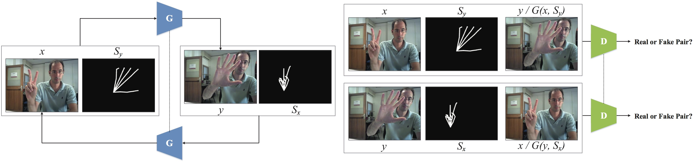
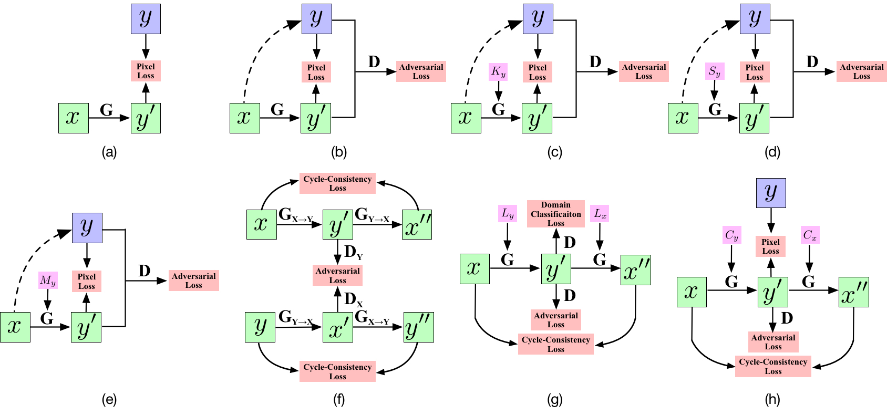

[](https://raw.githubusercontent.com/nvlabs/SPADE/master/LICENSE.md)

[]()


# GestureGAN for Controllable Image-to-Image Translation

## GestureGAN Framework


## Comparison with State-of-the-Art Image-to-Image Transaltion Methods


### [Conference paper](https://arxiv.org/abs/1808.04859) | [Project page (Conference paper)](http://disi.unitn.it/~hao.tang/project/GestureGAN.html) | [Slides](http://disi.unitn.it/~hao.tang/uploads/slides/GestureGAN_MM18.pptx) | [Poster](http://disi.unitn.it/~hao.tang/uploads/posters/GestureGAN_MM18.pdf)

GestureGAN for Hand Gesture-to-Gesture Translation in the Wild.<br>
[Hao Tang](http://disi.unitn.it/~hao.tang/)<sup>1</sup>, [Wei Wang](https://weiwangtrento.github.io/)<sup>1,2</sup>, [Dan Xu](http://www.robots.ox.ac.uk/~danxu/)<sup>1,3</sup>, [Yan Yan](https://userweb.cs.txstate.edu/~y_y34/)<sup>4</sup> and [Nicu Sebe](http://disi.unitn.it/~sebe/)<sup>1</sup>. <br> 
<sup>1</sup>University of Trento, Italy, <sup>2</sup>EPFL, Switzerland, <sup>3</sup>University of Oxford, UK, <sup>4</sup>Texas State University, USA.<br>
In ACM MM 2018 (**Oral** & **Best Paper Candidate**).<br>
The repository offers the implementation of our paper in PyTorch.

### [License](./LICENSE.md)

Copyright (C) 2019 University of Trento, Italy.

All rights reserved.
Licensed under the [CC BY-NC-SA 4.0](https://creativecommons.org/licenses/by-nc-sa/4.0/legalcode) (**Attribution-NonCommercial-ShareAlike 4.0 International**)

The code is released for academic research use only. For commercial use, please contact [hao.tang@unitn.it](hao.tang@unitn.it).

## Installation

Clone this repo.
```bash
git clone https://github.com/Ha0Tang/GestureGAN
cd GestureGAN/
```

This code requires PyTorch 0.4.1 and python 3.6+. Please install dependencies by
```bash
pip install -r requirements.txt (for pip users)
```
or 

```bash
./scripts/conda_deps.sh (for Conda users)
```

To reproduce the results reported in the paper, you would need two NVIDIA GeForce GTX 1080 Ti GPUs or two NVIDIA TITAN Xp GPUs.

## Dataset Preparation

For hand gesture-to-gesture translation tasks, we use NTU Hand Digit and Creative Senz3D datasets.
For cross-view image translation task, we use Dayton and CVUSA datasets.
These datasets must be downloaded beforehand. Please download them on the respective webpages. In addition, we put a few sample images in this [code repo](https://github.com/Ha0Tang/GestureGAN/tree/master/datasets/samples). Please cite their papers if you use the data. 

**Preparing NTU Hand Digit Dataset**. Since the original download link cannot access, we provide this dataset here. We adopt [OpenPose](https://github.com/CMU-Perceptual-Computing-Lab/openpose) to generate hand skeletons and use them as training data in our experiments. Note that we filter out failure cases in hand gesture estimation for training and testing. Please cite their papers if you use this dataset. Train/Test splits for Dayton dataset can be downloaded from [here](https://github.com/Ha0Tang/GestureGAN/tree/master/datasets/ntu_split).
Download images and the crossponding hand skeletons:
```bash
bash ./datasets/download_gesturegan_dataset.sh ntu
```

**Preparing Creative Senz3D Dataset**. The dataset can be downloaded [here](https://lttm.dei.unipd.it//downloads/gesture/#senz3d). We adopt [OpenPose](https://github.com/CMU-Perceptual-Computing-Lab/openpose) to generate hand skeletons and use them as training data in our experiments. Note that we filter out failure cases in hand gesture estimation for training and testing. Please cite their papers if you use this dataset.
Train/Test splits for Creative Senz3D dataset can be downloaded from [here](https://github.com/Ha0Tang/GestureGAN/tree/master/datasets/senz3d_split).

**Preparing Dayton Dataset**. The dataset can be downloaded [here](https://github.com/lugiavn/gt-crossview). In particular, you will need to download dayton.zip. 
Ground Truth semantic maps are not available for this datasets. We adopt [RefineNet](https://github.com/guosheng/refinenet) trained on CityScapes dataset for generating semantic maps and use them as training data in our experiments. Please cite their papers if you use this dataset.
Train/Test splits for Dayton dataset can be downloaded from [here](https://github.com/Ha0Tang/SelectionGAN/tree/master/datasets/dayton_split).

**Preparing CVUSA Dataset**. The dataset can be downloaded [here](https://drive.google.com/drive/folders/0BzvmHzyo_zCAX3I4VG1mWnhmcGc), which is from the [page](http://cs.uky.edu/~jacobs/datasets/cvusa/). After unzipping the dataset, prepare the training and testing data as discussed in [our paper](https://arxiv.org/abs/1904.06807). We also convert semantic maps to the color ones by using this [script](https://github.com/Ha0Tang/SelectionGAN/blob/master/scripts/convert_semantic_map_cvusa.m).
Since there is no semantic maps for the aerial images on this dataset, we use black images as aerial semantic maps for placehold purposes.

**Preparing Your Own Datasets**. Each training sample in the dataset will contain {Ix,Iy,Cx,Cy}, where Ix=image x, Iy=image y, Cx=Controllable structure of image x, and Cy=Controllable structure of image y.
Of course, you can use GestureGAN for your own datasets and tasks, such landmark-guided facial experssion translation and keypoint-guided person image generation.

## Generating Images Using Pretrained Model

Once the dataset is ready. The result images can be generated using pretrained models.

1. You can download a pretrained model (e.g. cvusa) with the following script:

```
bash ./scripts/download_selectiongan_model.sh cvusa
```
The pretrained model is saved at `./checkpoints/[type]_pretrained`. Check [here](https://github.com/Ha0Tang/SelectionGAN/blob/master/scripts/download_selection_model.sh) for all the available SelectionGAN models.

2. Generate images using the pretrained model.
```bash
python test.py --dataroot [path_to_dataset] --name [type]_pretrained --model selectiongan --which_model_netG unet_256 --which_direction AtoB --dataset_mode aligned --norm batch --gpu_ids 0 --batchSize [BS] --loadSize [LS] --fineSize [FS] --no_flip --eval
```
`[path_to_dataset]`, is the path to the dataset. Dataset can be one of `dayton`, `cvusa`, and `ego2top`. `[type]_pretrained` is the directory name of the checkpoint file downloaded in Step 1, which should be one of `dayton_a2g_64_pretrained`, `dayton_g2a_64_pretrained`, `dayton_a2g_256_pretrained`, `dayton_g2a_256_pretrained`, `cvusa_pretrained`,and `ego2top_pretrained`. If you are running on CPU mode, change `--gpu_ids 0` to `--gpu_ids -1`. For [`BS`, `LS`, `FS`],

- `dayton_a2g_64_pretrained`: [16,72,64]
- `dayton_g2a_64_pretrained`: [16,72,64]
- `dayton_g2a_256_pretrained`: [4,286,256]
- `dayton_g2a_256_pretrained`: [4,286,256]
- `cvusa_pretrained`: [4,286,256]
- `ego2top_pretrained`: [8,286,256]

Note that testing require large amount of disk space, because the model will generate 10 intermedia image results and 10 attention maps on disk. If you don't have enough space, append `--saveDisk` on the command line.

    
3. The outputs images are stored at `./results/[type]_pretrained/` by default. You can view them using the autogenerated HTML file in the directory.

## Training New Models

New models can be trained with the following commands.

1. Prepare dataset. 

2. Train.

```bash
# To train on the dayton dataset on 64*64 resolution,

python train.py --dataroot [path_to_dayton_dataset] --name [experiment_name] --model selectiongan --which_model_netG unet_256 --which_direction AtoB --dataset_mode aligned --norm batch --gpu_ids 0 --batchSize 16 --niter 50 --niter_decay 50 --loadSize 72 --fineSize 64 --no_flip --lambda_L1 100 --lambda_L1_seg 1 --display_winsize 64 --display_id 0
```
```bash
# To train on the datasets on 256*256 resolution,

python train.py --dataroot [path_to_dataset] --name [experiment_name] --model selectiongan --which_model_netG unet_256 --which_direction AtoB --dataset_mode aligned --norm batch --gpu_ids 0 --batchSize [BS] --loadSize [LS] --fineSize [FS] --no_flip --display_id 0 --lambda_L1 100 --lambda_L1_seg 1
```
- For dayton dataset, [`BS`,`LS`,`FS`]=[4,286,256], append `--niter 20 --niter_decay 15`.
- For cvusa dataset, [`BS`,`LS`,`FS`]=[4,286,256], append `--niter 15 --niter_decay 15`.
- For ego2top dataset, [`BS`,`LS`,`FS`]=[8,286,256], append `--niter 5 --niter_decay 5`.

There are many options you can specify. Please use `python train.py --help`. The specified options are printed to the console. To specify the number of GPUs to utilize, use `export CUDA_VISIBLE_DEVICES=[GPU_ID]`. Training will cost about one week with the default `--batchSize` on one NVIDIA GeForce GTX 1080 Ti GPU. So we suggest you use a larger `--batchSize`, while performance is not tested using a larger `--batchSize`.

To view training results and loss plots on local computers, set `--display_id` to a non-zero value and run `python -m visdom.server` on a new terminal and click the URL [http://localhost:8097](http://localhost:8097/).
On a remote server, replace `localhost` with your server's name, such as [http://server.trento.cs.edu:8097](http://server.trento.cs.edu:8097).

### Can I continue/resume my training? 
To fine-tune a pre-trained model, or resume the previous training, use the `--continue_train --which_epoch <int> --epoch_count<int+1>` flag. The program will then load the model based on epoch `<int>` you set in `--which_epoch <int>`. Set `--epoch_count <int+1>` to specify a different starting epoch count.


## Testing

Testing is similar to testing pretrained models.

```bash
python test.py --dataroot [path_to_dataset] --name [type]_pretrained --model selectiongan --which_model_netG unet_256 --which_direction AtoB --dataset_mode aligned --norm batch --gpu_ids 0 --batchSize [BS] --loadSize [LS] --fineSize [FS] --no_flip --eval
```

Use `--how_many` to specify the maximum number of images to generate. By default, it loads the latest checkpoint. It can be changed using `--which_epoch`.

## Code Structure

- `train.py`, `test.py`: the entry point for training and testing.
- `models/gesturegan_model.py`: creates the networks, and compute the losses
- `models/networks/`: defines the architecture of all models for selectiongan
- `options/`: creates option lists using `argparse` package. More individuals are dynamically added in other files as well. Please see the section below.
- `data/`: defines the class for loading images and semantic maps.

## Evaluation Code

We use several metrics to evaluate the quality of the generated images:

- Hand gesture-to-gesture translation: [Inception Score (IS)](https://github.com/openai/improved-gan) **|** [Fréchet Inception Distance (FID)](https://github.com/bioinf-jku/TTUR) **|** [PSNR](https://github.com/Ha0Tang/GestureGAN/blob/master/scripts/evaluation/compute_psnr.lua), need install `Lua` **|** [Fréchet ResNet Distance (FRD)](https://github.com/Ha0Tang/GestureGAN/blob/master/scripts/evaluation/FRD/calculate_FRD.m), need install `MATLAB 2016+`
- Cross-view image translation: [Inception Score](https://github.com/Ha0Tang/SelectionGAN/blob/master/scripts/evaluation/compute_topK_KL.py), need install `python 2.7` **|** [Top-k prediction accuracy](https://github.com/Ha0Tang/SelectionGAN/blob/master/scripts/evaluation/compute_accuracies.py), need install `python 2.7` **|** [KL score](https://github.com/Ha0Tang/SelectionGAN/blob/master/scripts/evaluation/KL_model_data.py), need install `python 2.7` **|** 
[SSIM](https://github.com/Ha0Tang/SelectionGAN/blob/master/scripts/evaluation/compute_ssim_psnr_sharpness.lua), need install `Lua` **|** [PSNR](https://github.com/Ha0Tang/SelectionGAN/blob/master/scripts/evaluation/compute_ssim_psnr_sharpness.lua), need install `Lua` **|** [SD](https://github.com/Ha0Tang/SelectionGAN/blob/master/scripts/evaluation/compute_ssim_psnr_sharpness.lua), need install `Lua` **|** [LPIPS](https://github.com/richzhang/PerceptualSimilarity)

### Citation
If you use this code for your research, please cite our papers.
```
@inproceedings{tang2018gesturegan,
  title={GestureGAN for Hand Gesture-to-Gesture Translation in the Wild},
  author={Tang, Hao and Wang, Wei and Xu, Dan and Yan, Yan and Sebe, Nicu},
  booktitle={ACM MM},
  year={2018}
}
```

## Acknowledgments
This source code is inspired by [Pix2pix](https://github.com/junyanz/pytorch-CycleGAN-and-pix2pix). We want to thank the NVIDIA Corporation for the donation of the TITAN Xp GPUs used in this work.

## Contributions
If you have any questions/comments/bug reports, feel free to open a github issue or pull a request or e-mail to the author Hao Tang ([hao.tang@unitn.it](hao.tang@unitn.it)).
